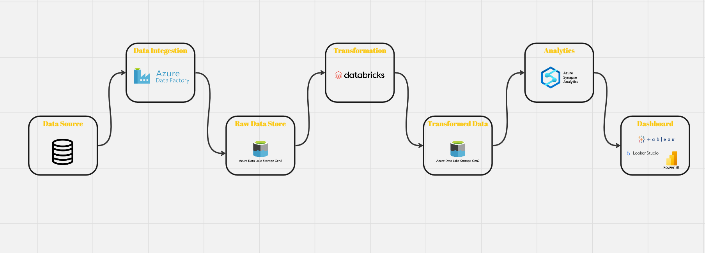

# Olympic Data Analytics Azure End-To-End Data Engineering Project

## Getting Started

Before you begin working on this project, you'll need to gather the necessary datasets. The primary dataset for this project, which contains data related to the 2021 Olympics in Tokyo, can be found on Kaggle. You can download it from the following link:

[2021 Olympics in Tokyo Dataset](https://www.kaggle.com/datasets/arjunprasadsarkhel/2021-olympics-in-tokyo)

Please make sure to download the dataset and place it in the appropriate location for your data processing pipeline.

## Project Architecture

To visualize the architecture of this project, please refer to our Miro board:

### Data Sources

The project's architecture includes five primary data sources in the form of CSV files:
1. Athletes Data
2. Coaches Data
3. Entries by Gender Data
4. Medals Data
5. Teams Data

### Data Ingestion

Data ingestion is handled by Azure Data Factory, which efficiently brings in data from the CSV files into our data processing pipeline.

### Raw Data Storage

Our raw data is stored in Azure Data Lake Gen2, providing a scalable and secure repository for large datasets.

### Data Transformation

Azure Databricks is used for data transformation, enabling us to process and refine the raw data into a more structured and usable format.

### Transformed Data Storage

The transformed data is stored back in Azure Data Lake Gen2, making it accessible for further analysis.

### Analytics

Azure Synapse Analytics is employed for advanced analytics and data exploration, allowing us to gain insights from the processed data.

### Dashboard Creation

We create visually compelling dashboards using a combination of tools:
- Power BI: For interactive data visualizations and reporting.
- Looker Studio: For data exploration and analytics.
- Tableau: For creating interactive and insightful dashboards.

## About Miro

[Miro](https://www.miro.com/) is an online collaborative whiteboard platform that enables teams to work visually, brainstorm ideas, plan projects, and more. In the context of our project, we've used Miro to visually represent the architecture, data flows, and components involved in our Olympic Data Analytics solution. It allows for better communication and understanding of our project's design and structure.

## Description

[Add a brief description of your project here.]

## Prerequisites

Before you get started with this project, make sure you have the following prerequisites in place:

- **Laptop:** You'll need a laptop or computer to work on this project.

- **Stable Internet Connection:** Ensure you have a stable internet connection for accessing cloud services and resources.

- **Basics of Python and SQL:** Familiarity with Python and SQL will be beneficial for working with data processing and analysis tasks.

- **Azure Account:** You'll need an Azure account to utilize Azure services such as Data Lake Gen2, Azure Data Factory, Azure Databricks, and Azure Synapse Analytics.

## Getting Started

[Include instructions on how to set up and run your project.]

## Usage

[Provide information on how to use your project or any relevant commands.]

## Contributors

[List the contributors to your project.]

## License

[Specify the license for your project, if applicable.]
